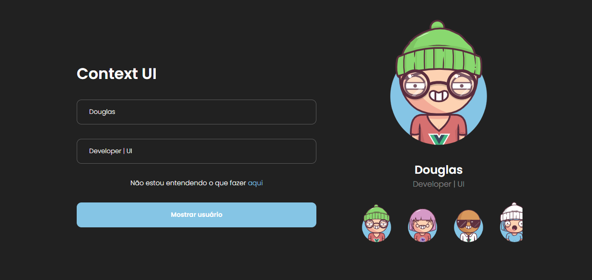

# ContextUI
Projeto em react desenvolvido para aplicar conhecimentos em Context



## 🚀 Tecnologias
- ✔️ React - Biblioteca web
- ✔️ Typescript - Superset do Javascript
- ✔️ Vite - Bundler e dev-server

<br />

## 💄 Recursos utilizados
- ✔️ Big Heads Avatar - <https://bigheads.io/>
- ✔️ Swiper Lib - <https://swiperjs.com/>

<br />

## 📦️ Pré-Requisitos
Antes de começar você vai precisar ter instalado na sua máquina as ferramentas [Git](https://git-scm.com/) e [Node](https://nodejs.org/en/download/).

<br />

## Executando o projeto
1. Clone o repositório
```
    git clone https://github.com/DouglasLacerdaC/ContextUI.git
```
2. Acesse a pasta do projeto e instale as dependências
```
    yarn
```
3. Execute o projeto
```
    yarn dev
```
4. Acesse pelo navegador
```
    http://127.0.0.1:5173/
```
4. Hey
```
    Aproveite e implemente mais conteúdo ao projeto. ;)
```

<br />

<p align="center">Desenvolvido por <a href=“https://www.linkedin.com/in/douglas-lacerda-da-conceicao/“>Douglas Lacerda</a></p>